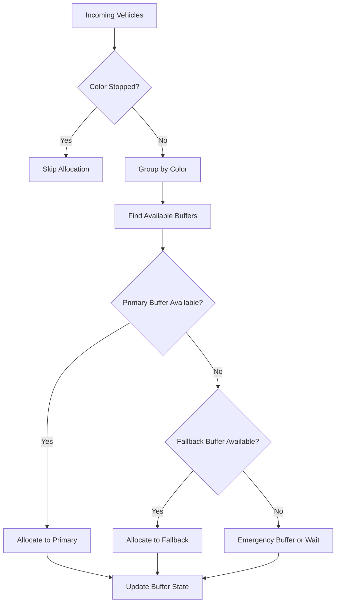
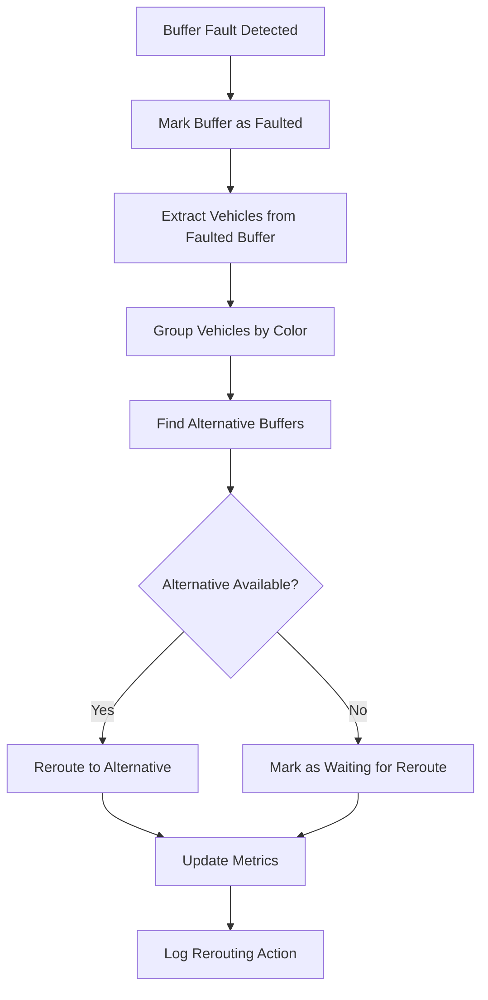
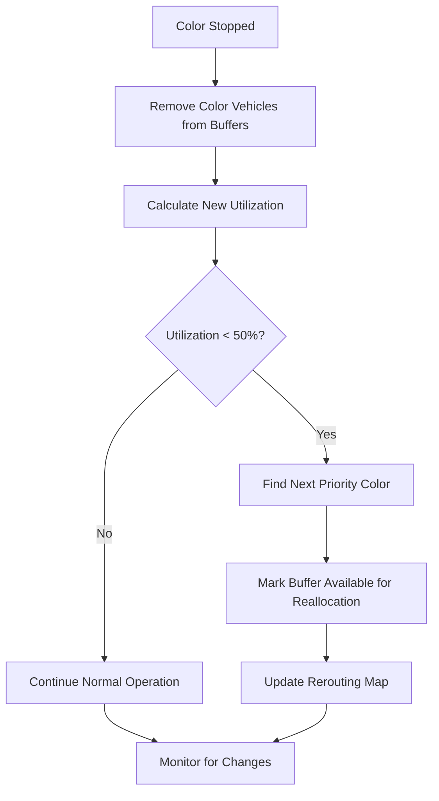

# Advanced Scheduling Algorithm - Comprehensive Buffer Management System

## Overview

The Advanced Scheduling Algorithm extends the basic scheduling system with sophisticated fault tolerance, color management, and intelligent rerouting capabilities. This system addresses real-world manufacturing challenges including equipment failures, quality issues, and dynamic production requirements.

## 🎯 Key Features

### 1. **Color Stop Functionality**
- **Purpose**: Temporarily halt processing of specific colors due to quality issues, material shortages, or maintenance
- **Implementation**: Colors can be stopped with reason tracking and automatic rerouting
- **Use Cases**: 
  - Quality control issues detected for specific paint colors
  - Material shortage for particular colors
  - Scheduled maintenance affecting color-specific equipment

### 2. **Buffer Fault Management**
- **Purpose**: Handle equipment failures and maintenance on specific buffer lines
- **Implementation**: Buffers can be marked as faulted with automatic vehicle rerouting
- **Use Cases**:
  - Mechanical failures on buffer lines
  - Scheduled maintenance windows
  - Equipment upgrades or repairs

### 3. **Intelligent Fallback System**
- **Purpose**: Ensure continuous operation when primary buffers are unavailable
- **Implementation**: Multi-tier fallback mapping with priority-based selection
- **Benefits**: Minimizes production disruption and maintains throughput

### 4. **50% Utilization Rule**
- **Purpose**: Optimize buffer usage when colors are stopped or rerouted
- **Implementation**: When buffer utilization drops below 50%, allow next priority color
- **Benefits**: Maximizes buffer efficiency and prevents underutilization

## 🏗️ System Architecture

### Core Components

#### 1. **AdvancedSchedulingService**
```javascript
class AdvancedSchedulingService {
  // Enhanced state management
  stoppedColors: Set<string>           // Temporarily stopped colors
  faultedBuffers: Set<string>          // Offline/faulted buffers
  colorStopReasons: Map<string, object> // Tracking stop reasons
  bufferFaultReasons: Map<string, object> // Tracking fault reasons
  rerouting: Map<string, object>       // Active rerouting decisions
}
```

#### 2. **Enhanced Buffer States**
```javascript
bufferState = {
  current: number,           // Current vehicle count
  capacity: number,          // Maximum capacity
  vehicles: Array,           // Vehicle queue (FIFO)
  status: string,           // 'active', 'faulted', 'maintenance'
  faultReason: string,      // Reason for fault (if applicable)
  maintenanceUntil: Date,   // Scheduled maintenance end
  utilizationHistory: Array // Historical utilization data
}
```

#### 3. **Color Fallback Mapping**
```javascript
const COLOR_FALLBACK_MAP = {
  'C1': ['L1', 'L2', 'L9'],           // Primary → Overflow → Emergency
  'C2': ['L3', 'L2', 'L4', 'L9'],    // Primary → Flex → Overflow → Emergency
  'C3': ['L4', 'L9'],                // Primary → Emergency
  // ... additional mappings
};
```

## 🔄 Algorithm Flow

### 1. **Enhanced Vehicle Allocation**



### 2. **Fault Handling Process**



### 3. **50% Utilization Rule**



## 🎛️ Control Interface

### Color Management
```javascript
// Stop a color with reason
advancedSchedulingService.stopColor('C1', 'Quality issue detected');

// Resume a stopped color
advancedSchedulingService.resumeColor('C1');

// Get stopped colors status
const status = advancedSchedulingService.getAdvancedSystemStatus();
console.log(status.stoppedColors); // ['C1', 'C3']
```

### Buffer Management
```javascript
// Fault a buffer with reason
advancedSchedulingService.faultBuffer('L1', 'Mechanical failure');

// Clear buffer fault
advancedSchedulingService.clearBufferFault('L1');

// Get faulted buffers status
const status = advancedSchedulingService.getAdvancedSystemStatus();
console.log(status.faultedBuffers); // ['L1', 'L5']
```

## 📊 Enhanced Metrics

### Standard Metrics
- **Total Processed**: Total vehicles completed
- **Color Changeovers**: Main conveyor color changes
- **Buffer Overflows**: Allocation failures due to capacity

### Advanced Metrics
- **Faulted Buffers**: Number of offline buffers
- **Stopped Colors**: Number of halted colors
- **Reroutes**: Total vehicle rerouting actions
- **Efficiency Penalties**: Impact of faults and stops on overall efficiency

### Efficiency Calculation
```javascript
baseEfficiency = (currentJPH / theoreticalMaxJPH) * 100;
penalties = {
  changeover: colorChangeovers * 2,
  overflow: bufferOverflows * 5,
  fault: faultedBuffers * 10,      // NEW: Fault penalty
  stop: stoppedColors * 5          // NEW: Stop penalty
};
finalEfficiency = baseEfficiency - sum(penalties);
```

## 🔧 Implementation Examples

### Scenario 1: Quality Issue with C1
```javascript
// Quality control detects issue with C1 paint
advancedSchedulingService.stopColor('C1', 'Quality control failure - batch contamination');

// System automatically:
// 1. Stops accepting new C1 vehicles
// 2. Reroutes existing C1 vehicles from buffers
// 3. Marks affected buffers for reallocation if utilization < 50%
// 4. Updates metrics and logs actions
```

### Scenario 2: L1 Buffer Mechanical Failure
```javascript
// Maintenance reports L1 buffer mechanical failure
advancedSchedulingService.faultBuffer('L1', 'Conveyor motor failure - estimated 4 hours repair');

// System automatically:
// 1. Marks L1 as faulted and offline
// 2. Reroutes all vehicles from L1 to L2 (C1 overflow buffer)
// 3. Updates allocation logic to exclude L1
// 4. Tracks rerouting metrics
```

### Scenario 3: Combined Fault and Stop
```javascript
// Complex scenario: L1 faulted AND C1 stopped
advancedSchedulingService.faultBuffer('L1', 'Equipment failure');
advancedSchedulingService.stopColor('C1', 'Material shortage');

// System handles:
// 1. L1 vehicles rerouted to alternative buffers
// 2. C1 vehicles marked as waiting (can't be processed)
// 3. L2 buffer (C1 overflow) becomes available for C2
// 4. Automatic reallocation based on 50% rule
```

## 🎯 Benefits

### Operational Benefits
1. **Continuous Operation**: System continues running despite equipment failures
2. **Quality Control**: Ability to halt problematic colors immediately
3. **Maintenance Flexibility**: Scheduled maintenance without full system shutdown
4. **Resource Optimization**: 50% rule ensures efficient buffer utilization

### Management Benefits
1. **Real-time Visibility**: Complete status of all colors and buffers
2. **Reason Tracking**: Full audit trail of stops and faults
3. **Performance Metrics**: Enhanced KPIs including fault impact
4. **Predictive Insights**: Historical data for maintenance planning

### Technical Benefits
1. **Fault Tolerance**: Graceful degradation under failure conditions
2. **Intelligent Routing**: Multi-tier fallback system
3. **State Management**: Comprehensive tracking of system state
4. **Extensibility**: Easy to add new features and conditions

## 🧪 Testing

### Test Scenarios Covered
1. **Color Stop/Resume Functionality**
2. **Buffer Fault/Clear Operations**
3. **Fallback Buffer Selection**
4. **50% Utilization Rule Triggering**
5. **Combined Fault and Stop Scenarios**
6. **Rerouting and Reallocation Logic**

### Test Execution
```bash
# Run comprehensive test suite
node src/backend/test/advancedSchedulingTest.js

# Expected output demonstrates:
# - Color stopping with reason tracking
# - Buffer fault management
# - Intelligent fallback selection
# - Automatic rerouting
# - 50% utilization rule application
```

## 🚀 Future Enhancements

### Planned Features
1. **Predictive Maintenance**: ML-based fault prediction
2. **Dynamic Capacity**: Real-time capacity adjustments
3. **Multi-Shift Planning**: Shift-based color and buffer management
4. **Integration APIs**: External system integration for ERP/MES
5. **Advanced Analytics**: Detailed performance dashboards

### Scalability Considerations
1. **Multi-Plant Support**: Extend to multiple manufacturing facilities
2. **Cloud Integration**: Real-time synchronization across locations
3. **Mobile Interface**: Mobile app for floor managers
4. **IoT Integration**: Direct equipment status monitoring

This advanced scheduling algorithm provides a robust, fault-tolerant solution for complex manufacturing environments while maintaining the simplicity and efficiency of the core scheduling logic.